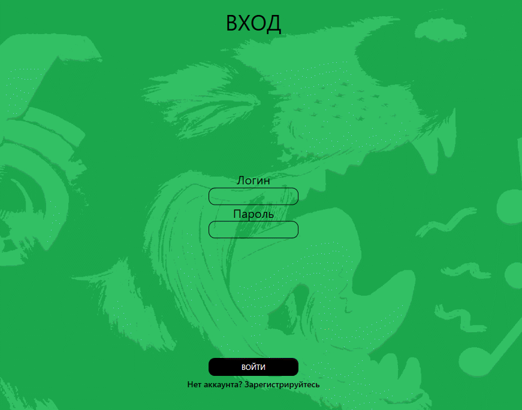
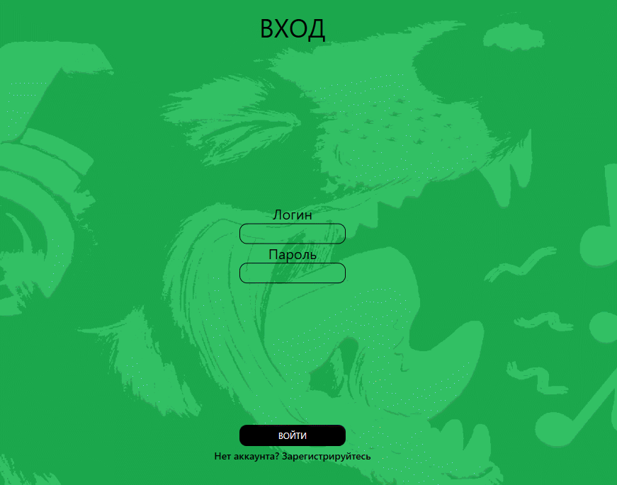
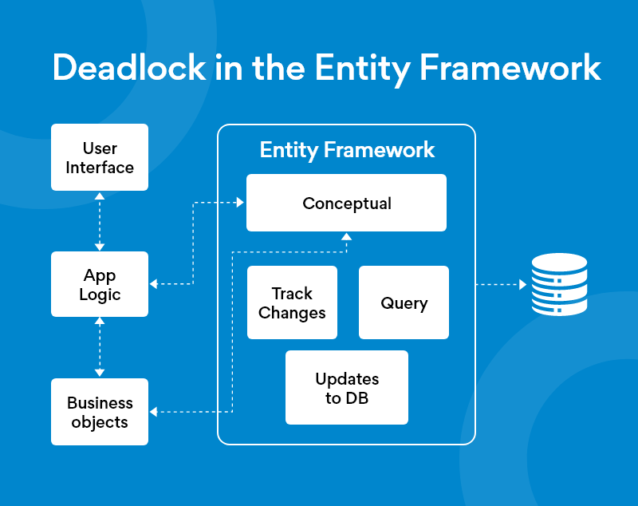

# КонцертМейт: Ваш гид по миру музыки

## Зачем оно нужно

Приложение создано для того, чтобы *облегчить* просмотр информации о концертах,  
проходящих в городе и скомпоновать их, в одном месте.

Функционал реализован таким образом, чтобы просматривать все концерты, которые проходят в конкретном городе.
Также есть функционал для администратора, для более *удобной* работы с базой.

---

## Технологии в проекте

Весь проект написан с использованием технологии **WPF** и соответственно на языке **C#**.
Также для обмена данными между БД и приложением был использован **Entity Framework**.

## Дорожная карта

В данный момент в программе реализовано:

Для администратора:
- [x] Просмотр и редактирование данных о концертах
- [x] Просмотр данных о всех пользователях
- [x] Фильтрация пользователей по одному из трёх параметров
- [x] Фильтрация данных о концертах

Для пользователя:
- [ ] Вход в личный кабинет
- [ ] Редактирование личных данных
- [ ] Редактирование аутентификационных данных

## Установка и запуск

Для установки и запуска требуется клонировать проект с помощью среды разработки **Visual Studio**.
После этого нужно открыть файл с расширением **sln**. 
Далее нажать на кнопку *Пуск* на верхней панели или клавишу *F5* на клавиатуре.

*Также стоит упомянуть что возможно для коррктной работы потребуется поменять строку подключения в файле App.config*

	<connectionStrings>
	<add name="Music" connectionString="metadata=res://*/Model1.csdl|res://*/Model1.ssdl|res://*/Model1.msl;provider=System.Data.SqlClient;provider connection string=&quot;data source=sql;initial catalog=43П-МДК0101-Ермолин;persist security info=True;user id=43П;password=444444;MultipleActiveResultSets=True;App=EntityFramework&quot;" providerName="System.Data.EntityClient" />
	</connectionStrings>

*Изменить на data source=ngknn.ru*
	
	data source=sql

### Авторы

*Я*
Ссылка на этот же проект на gogs - [Gogs](http://gogs.ngknn.ru:3000/FoxInBox/ConcertAfisha)